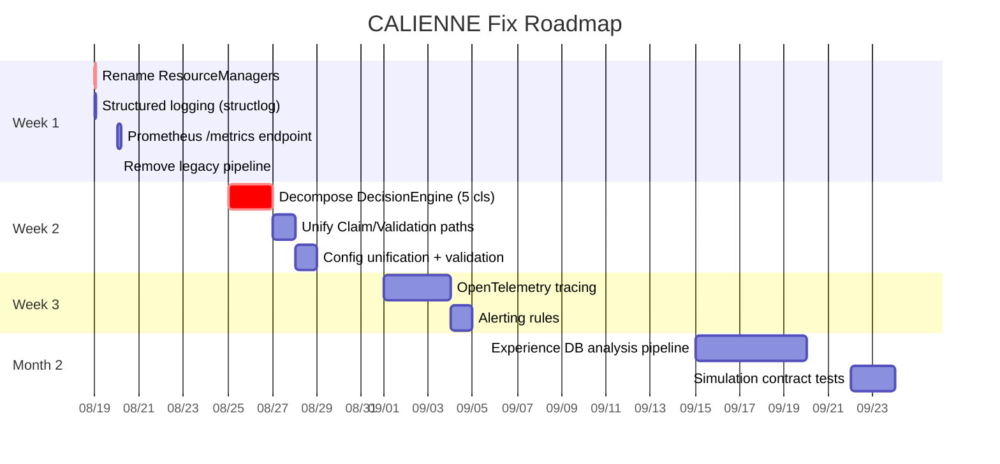

# CALIENNE — Issues & Fixes Roadmap

> Generated: 2026-08-19 | Based on architecture v0.1.7 deep research

---

## Priority Matrix

| Priority | Issue | Effort | Impact | Status |
|----------|-------|--------|--------|--------|
| 🔴 CRITICAL | God-object `DecisionEngine` | 1-2 days | Architectural foundation | ☐ Not started |
| 🟠 HIGH | Dual `ResourceManager` name collision | 30 min | Immediate confusion elimination | ☐ Not started |
| 🟠 HIGH | Claim/Validation overlap (dual paths) | 1 day | Consistency, maintainability | ☐ Not started |
| 🟡 MEDIUM | Legacy pipeline dead code | 1 hr | Cognitive load reduction | ☐ Not started |
| 🟡 MEDIUM | Observability gaps (no OTel, Prometheus, structured logs) | 2-3 days | Production readiness | ☐ Not started |
| 🟡 MEDIUM | Config complexity (7 JSON files, no validation) | 1 day | Prevents capability drift | ☐ Not started |
| 🔵 LOW | Experience DB offline-only landfill | 1 week | Unlocks learning loop | ☐ Not started |
| 🔵 LOW | Simulation parity contract tests | 2 days | CI confidence | ☐ Not started |

---

## 🔴 CRITICAL: Decompose DecisionEngine (`orchestrator/decisions.py`)

### Problem
Single 621-line class owns: Breaker gate (100ms), 3 generation strategies, Judge synthesis, metrics, streaming events, provider dispatch.

### Target Architecture (5 Classes)

```
orchestrator/
├── breaker_gate.py           # BreakerGate — 100ms timeout, knowledge absence
├── generation_orchestrator.py # GenerationOrchestrator — PARALLEL/SEQUENTIAL/CONDITIONAL
├── judge_synthesizer.py      # JudgeSynthesizer — synthesis + placeholder handling
├── decision_metrics.py       # DecisionMetricsCollector — pure rolling-window aggregation
├── agent_dispatcher.py       # AgentDispatcher — provider call routing via RuntimeEngine
└── decisions.py              # Thin facade delegating to above (backward compat)
```

### Acceptance Criteria
- [ ] Each class < 150 lines, single responsibility
- [ ] Unit tests for each in isolation (mock gateway, strategy, pool, passport)
- [ ] `DecisionEngine` becomes ~50-line facade
- [ ] No behavioral change — all existing tests pass

---

## 🟠 HIGH: Rename Dual ResourceManager

### Current State
| File | Class | Responsibility |
|------|-------|----------------|
| `api_gateway/rate_limiter.py` | `ResourceManager` | Provider-level: semaphores, circuit breaker, retry/backoff |
| `orchestrator/resource_manager.py` | `ResourceManager` | DAG-level: global/route/model concurrency ceilings |

### Fix
```bash
# 1. Rename in api_gateway/rate_limiter.py
ResourceManager → ProviderResourceManager

# 2. Rename in orchestrator/resource_manager.py
ResourceManager → DagConcurrencyManager

# 3. Update imports in:
orchestrator/calienne_orchestrator.py  (both imports)
orchestrator/execution_manager.py      (uses DagConcurrencyManager)
```

### Acceptance Criteria
- [ ] Zero name collisions
- [ ] Clear ownership: provider vs DAG concurrency
- [ ] All tests pass

---

## 🟠 HIGH: Unify Claim/Validation Paths

### Current Overlap
```python
# pipelines.py lines 1004-1035 — TWO CODE PATHS
if validation_layer is not None:
    all_claims = validation_layer.process_claims(...)
    final_answer, unverified_dicts, firewall_result = validation_layer.apply_firewall(...)
else:
    all_claims = _process_claims_for_outputs(claim_manager, ...)
    final_answer, unverified_dicts, firewall_result = _apply_output_firewall(claim_manager, ...)
```

### Target: Single `ValidationPipeline`

```
orchestrator/
├── validation_pipeline.py    # ValidationPipeline
│   ├── extract_claims()
│   ├── build_evidence()
│   ├── validate_claims()
│   └── apply_firewall()
├── claims.py                 # ClaimManager — storage, provenance, graph tracking only
└── validation_layer.py       # DEPRECATED → remove or thin adapter
```

### Acceptance Criteria
- [ ] Single code path in `pipelines.py`
- [ ] `ValidationPipeline` owns extraction → evidence → validation → firewall
- [ ] `ClaimManager` only handles persistence/provenance
- [ ] Feature flag `KNOWLEDGE_LAYER` controls enablement, not code path

---

## 🟡 MEDIUM: Remove Legacy Pipeline

### Dead Code Locations
- `pipelines.py` lines 209-493: `calienne_LEGACY_PIPELINE_ENABLED` branch (~280 lines)
- `pipelines.py`: `_LEGACY_PIPELINE_ENV`, `_is_legacy_pipeline_opted_in()`, `_legacy_pipeline_blocked_msg()`
- References to removed `stream_micro_mode` generator

### Fix
```bash
# Delete from pipelines.py:
- _LEGACY_PIPELINE_ENV constant
- _legacy_pipeline_blocked_msg()
- _is_legacy_pipeline_opted_in()
- Entire legacy branch (lines 209-493)
- stream_micro_mode references
```

### Acceptance Criteria
- [ ] CRIT-001 already enforces DecisionEngine — legacy unreachable
- [ ] File size reduced ~280 lines
- [ ] No runtime path references legacy code

---

## 🟡 MEDIUM: Observability Stack

### 1. Structured Logging (Week 1)
```python
# core/config.py — add structlog config
# main.py / server.py — replace basicConfig
import structlog
structlog.configure(
    processors=[
        structlog.stdlib.add_log_level,
        structlog.processors.TimeStamper(fmt="iso"),
        structlog.processors.JSONRenderer()
    ]
)
```

### 2. Prometheus Metrics (Week 1)
```python
# orchestrator/decision_metrics.py — expose via prometheus_client
# server.py — add /metrics endpoint
from prometheus_client import Counter, Histogram, Gauge, generate_latest

BREAKER_PASS_RATE = Gauge('calienne_breaker_pass_rate', 'Breaker gate pass rate')
JUDGE_AGREEMENT_RATE = Gauge('calienne_judge_agreement_rate', 'Judge agreement rate')
SYNTHESIS_QUALITY = Gauge('calienne_synthesis_quality_avg', 'Avg validation score')
PROVIDER_HEALTH = Gauge('calienne_provider_health', 'Provider health', ['provider', 'status'])
```

### 3. OpenTelemetry Tracing (Week 2)
```python
# core/telemetry.py — new module
from opentelemetry import trace
from opentelemetry.exporter.otlp.proto.grpc.trace_exporter import OTLPSpanExporter
from opentelemetry.sdk.trace import TracerProvider
from opentelemetry.sdk.trace.export import BatchSpanProcessor

# Trace: breaker → logician → creative → judge → firewall
# Attributes: provider, model, latency, tokens, validation_score
```

### 4. Alerting Rules (Week 2)
```yaml
# monitoring/alerts.yml
groups:
- name: calienne
  rules:
  - alert: BreakerPassRateLow
    expr: calienne_breaker_pass_rate < 0.8
    for: 5m
  - alert: JudgeAgreementLow
    expr: calienne_judge_agreement_rate < 0.7
    for: 5m
  - alert: ProviderDead
    expr: calienne_provider_health{status="dead"} == 1
    for: 1m
```

### Acceptance Criteria
- [ ] JSON logs in production
- [ ] `/metrics` endpoint returns Prometheus format
- [ ] Traces visible in Jaeger/Grafana Tempo
- [ ] Alerts fire on SLO breach

---

## 🟡 MEDIUM: Config Unification

### Current Fragmentation
```
config/capabilities/
├── model_capabilities.json
├── provider_limits.json
├── pricing.json
├── routing_defaults.json
└── prediction_calibration.json
config/feature_flags.json
config/prompt_versions.json
```

### Target: Single Validated Config
```python
# config/schema.py — Pydantic model
class CalienneConfig(CalienneBaseModel):
    model_capabilities: dict[str, ModelCapability]
    provider_limits: dict[str, ProviderLimit]
    pricing: dict[str, Pricing]
    routing_defaults: RoutingDefaults
    prediction_calibration: PredictionCalibration
    feature_flags: FeatureFlags
    prompt_versions: dict[str, str]

# config/loader.py — unified loader with validation
def load_config() -> CalienneConfig:
    # 1. Load all JSON files
    # 2. Apply env overrides (warn on override)
    # 3. Validate cross-references (model in capabilities ↔ provider_limits ↔ pricing)
    # 4. Return typed config
```

### Acceptance Criteria
- [ ] Single `CalienneConfig` object at startup
- [ ] Cross-file validation (no orphan models/providers)
- [ ] Env override warnings logged
- [ ] Type-safe access everywhere

---

## 🔵 LOW: Experience DB Analysis Pipeline

### Current State
- Tables: `experience_operational` + `experience_learning`
- Offline-only (ADR-008)
- Manual-PR promotion only

### Target Pipeline
```
scripts/
├── analyze_experience.py      # Nightly cron job
│   ├── mine_failure_patterns()
│   ├── propose_calibration_updates()
│   └── generate_promotion_pr.py
├── calibration/
│   ├── promoter.py            # Creates PR with calibration changes
│   └── reviewer.py            # Human review checklist
```

### Acceptance Criteria
- [ ] Nightly job runs, produces calibration proposals
- [ ] Auto-PR created with `calibration/` label
- [ ] Reviewer checklist: pattern recurrence, drift, confidence
- [ ] Promotion latency < 48 hours

---

## 🔵 LOW: Simulation Contract Tests

### Current Gap
- Simulation mode fabricates deterministic mocks
- No verification vs real provider behavior
- Production refuses simulation (hard error)

### Target: Golden Fixture Tests
```
tests/
├── fixtures/
│   ├── providers/
│   │   ├── openrouter_gpt4o.json
│   │   ├── groq_llama3.json
│   │   └── nvidia_nemotron.json
│   └── fallback_chains/
│       ├── primary_timeout.json
│       └── all_exhausted.json
├── contract/
│   ├── test_simulation_parity.py     # Assert simulation structure = real
│   ├── test_fallback_chains.py       # Mock provider failures
│   └── test_streaming_parity.py      # SSE events match
```

### Acceptance Criteria
- [ ] CI runs contract tests on every PR
- [ ] Simulation output structure validated against golden fixtures
- [ ] Fallback chains tested with mocked 429/503/timeouts
- [ ] Streaming/blocking parity verified

---

## Execution Order (Recommended)



---

## File Touch Map

| Fix | Files to Modify | New Files |
|-----|-----------------|-----------|
| Rename ResourceManager | `api_gateway/rate_limiter.py`, `orchestrator/resource_manager.py`, `orchestrator/calienne_orchestrator.py`, `orchestrator/execution_manager.py` | — |
| Structured logging | `core/config.py`, `main.py`, `server.py` | — |
| Prometheus metrics | `orchestrator/decision_metrics.py`, `server.py` | `orchestrator/metrics.py` |
| Remove legacy pipeline | `orchestrator/pipelines.py` | — |
| Decompose DecisionEngine | `orchestrator/decisions.py` | `breaker_gate.py`, `generation_orchestrator.py`, `judge_synthesizer.py`, `decision_metrics.py`, `agent_dispatcher.py` |
| Unify Claim/Validation | `orchestrator/pipelines.py`, `orchestrator/claims.py`, `orchestrator/validation_layer.py` | `orchestrator/validation_pipeline.py` |
| Config unification | `core/config.py` | `config/schema.py`, `config/loader.py` |
| OpenTelemetry | `server.py`, `main.py` | `core/telemetry.py`, `monitoring/alerts.yml` |
| Experience DB pipeline | — | `scripts/analyze_experience.py`, `scripts/calibration/promoter.py` |
| Simulation tests | — | `tests/fixtures/`, `tests/contract/` |

---

## Definition of Done (Per Fix)

- [ ] Code compiles, type-checks (`mypy --strict`)
- [ ] All existing tests pass (`pytest -x`)
- [ ] New unit tests added for new classes
- [ ] Integration test passes (full pipeline run)
- [ ] Documentation updated (docstrings, README if needed)
- [ ] No regression in validation scores on benchmark queries

---

## Notes for Implementer

1. **Start with renames** — lowest risk, highest immediate clarity
2. **DecisionEngine decomposition is the keystone** — enables all adaptive v1 work
3. **Observability before features** — you can't improve what you can't measure
4. **Config unification prevents subtle bugs** — capability drift causes routing errors
5. **Experience DB pipeline unlocks the learning loop** — currently write-only

---

*Track progress in `@session:default/...` — update checkboxes as completed*